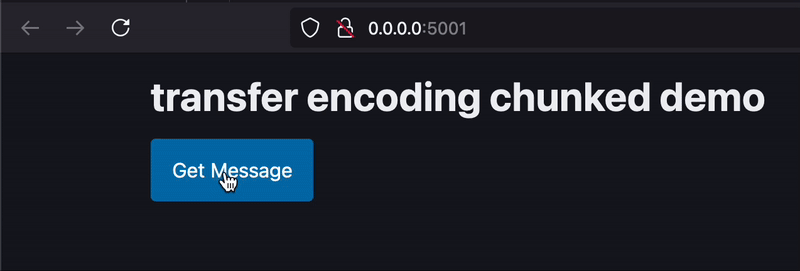

# htmx transfer encoding chunked extension

This extension adds chunked transfer encoding to htmx 2.x requests. \following bigskysoftware/htmx#1911

The code is heavily inspired by this existing extension, which only works with htmx 1.x:
https://github.com/douglasduteil/htmx.ext...chunked-transfer

## Install

```html
<script src="https://unpkg.com/htmx-ext-transfer-encoding-chunked@0.2.0/transfer-encoding-chunked.js"></script>
```

## Usage

```html
<body hx-ext="chunked-transfer">
  ...
</body>
```

## Showcase


